- Python for ML
___
- **Numpy**
Importing 
`import numpy as np`
Numpy Array
```python
1. a = np.array([1,2,3])
2. my_matrix = [[1,2,3],[4,5,6],[7,8,9]]
b = np.array(my_matrix)
m = np.asmatrix(b)
```
`.ndim type(b)`
Methods
`np.zeros(3) np.zeros(3,3)`
`np.ones()`
`np.arange(0,10)`
`np.linspace(0,10)`
`np.eye(2)`
Random Number Generation
`np.random.rand()`
`np.random.randn()`
`np.random.randint(0,50,10)`
Reshaping
`arr = np.arange(25)`
`arr.reshape(5,5)`
max
```
ranarr = np.random.randint(0,50,10)
ranarr.max()
ranarr.argmax()
```
Slicing
```
arr = np.arange(25)
slice_of_arr = arr[0:6]
```
Broadcasting
`arr[0:6]=100`
Copy
`arr_copy = arr.copy()`
Indexing
```
arr[8]
arr_2d = arr.reshape(5,5)
arr_2d[:2,:1]
```
Operations
```
arr>4
arr[arr>4]
arr+100
```
Operation with 0 as an element
```
arr[0]=0
arr/arr
np.sqrt(arr)
np.argmax(arr)
np.max(arr)

mat=np.arange(1,26).reshape(5,5)
mat[2:,1:]
mat.sum()
mat.sum(axis=0)
```
np.dot()
```
x = np.array([[1,2],[3,4]])
y = np.array([[5,6],[7,8]])

v = np.array([9,10])
w = np.array([11, 12])
x+v

v.dot(w)
v@w
np.dot(v,w)
```
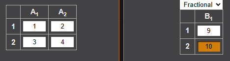
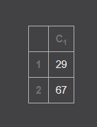
np.multiply()
```
print(v*w)
print(np.multiply(v, w))

print(v.T)
```
Operations on 2d
```
#Set up matrix
arr2d = np.zeros((10,10))
#Length of array
arr_length = arr2d.shape[1]

#Set up array

for i in range(arr_length):
    arr2d[i] = i
    
arr2d[arr2d>2]
```
___
- **Pandas**
Series
```
labels = ['Prashant','Ishan','Samman']
my_list = [1,4,5]
arr = np.array([1,4,5])
d = {'Prashant':1,'Ishan':4,'Samman':5}
```
using List
`pd.Series(data=my_list)`
```
print("Familarity With Python")
pd.Series(data=my_list,index=labels)
```
Using Numpy Array
```
pd.Series(data = arr)
pd.Series(arr,labels)
```
Using Dictionary
```
1. ser = pd.Series(d)
ser['Prashant']
2. ser1 = pd.Series([1,2,3,4],index = ['USA', 'Germany','USSR', 'Japan'])        
ser2 = pd.Series([1,2,5,4],index = ['USA', 'Germany','Italy', 'Japan'])     
ser1+ser2
```
`ser1.add(ser2)`
DataFrame
```
1 df = pd.DataFrame(randn(5,4),index=('A', 'B' ,'C','D','E'),columns='W X Y Z'.split())
2 type(df)
3 type(df['W'])
4 df['new'] = df['W'] + df['Y']
5. df.drop('new',axis=1)
6. use of inplace
df.drop('new',axis=1,inplace=True)

```
axis=0 axis=1
`df.drop('C',axis=0)`
Selecting Data
```
1. df.index
2. df.loc['A']
df.loc['B','Y']
df.loc['A':'D','W':'Y']
3. df.loc[df.W>0,:]
```
**df.iloc()**
```
1.df.iloc[2]
2.df.iloc[[2,4],1]
3.list(df.W >0)
4.df.iloc[list(df.W >0),:]
```
Operations
```
1.df>0
df[df>0]
df[df['W']>0]['Y']
df[(df['W']>0) & (df['Y'] <0)]
2 df.reset_index(inplace = True)
df.set_index('index',inplace=True)
3.df = pd.DataFrame({'CE':[1,2,0],
                  'CS':[5,0,2],
                  'EE':[11,20,0],
                  'Pharmacy':[23,15,np.nan]},index=['C++','Math','Electrical'])
				  df.dropna()
				  df.dropna(axis=1)
```
Filling Values				  
```
1.df.fillna(value='FILL VALUE')
2.df['Pharmacy'].fillna(value=df['Pharmacy'].mean(),inplace=True)
3.data = {'Subject':['DBMS','DBMS','MCSC','MCSC','DIFF','DIFF'],
       'Instructor':['Santosh','Nabin','Gokul','Ram','Saraswoti','Khim'],
       'Assignments':[10,2,4,5,6,4]}
df = pd.DataFrame(data)
by_comp = df.groupby('Subject')
by_comp

by_comp.mean()
df.head()
4.df['Subject'].unique()
5.df['Instructor'].nunique()
6.df['Subject'].value_counts()
```

```
df = pd.DataFrame({'col1':[1,2,3,4],'col2':[444,555,666,444],'col3':['abc','def','ghi','xyz']})
df.head()
def times2(x):
    return x*2
df.apply(times2)
df.isnull()
```
- MatplotLib
- `import matplotlib.pyplot as plt`
```
import numpy as np
x = np.linspace(0, 5, 11)
y = x ** 2+2
plt.plot(x, y, 'r') # 'r' is the color red
plt.xlabel('X')
plt.ylabel('Y')

plt.title(r"$y=x^2+2$")
# plt.show()
```
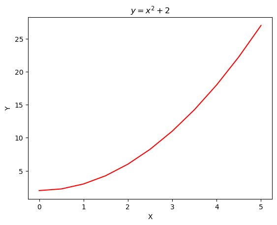
**Subplots**
```
import numpy as np
x = np.linspace(0, 5, 11)
y = x ** 2+2
# plt.subplot(nrows, ncols, plot_number)
plt.subplot(2,1,1)
plt.plot(x, y, 'r--') # More on color options later
plt.subplot(2,1,2)
plt.plot(y, x, 'g*:')
```
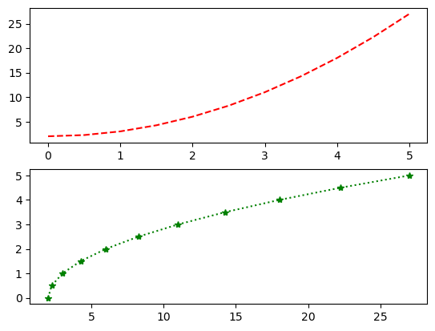
**Object Oriented Method**
```
fig = plt.figure()

axes = fig.add_axes([0.5, 0.1, 0.7, 0.7])

fig = plt.figure()
# Add set of axes to figure
axes = fig.add_axes([0.1, 0.1, 0.8, 0.8]) # left, bottom, width, height (range 0 to 1)

# Plot on that set of axes
axes.plot(x, y, 'b')
axes.set_xlabel('Set X Label') # Notice the use of set_ to begin methods
axes.set_ylabel('Set y Label')
axes.set_title('Set Title')
```
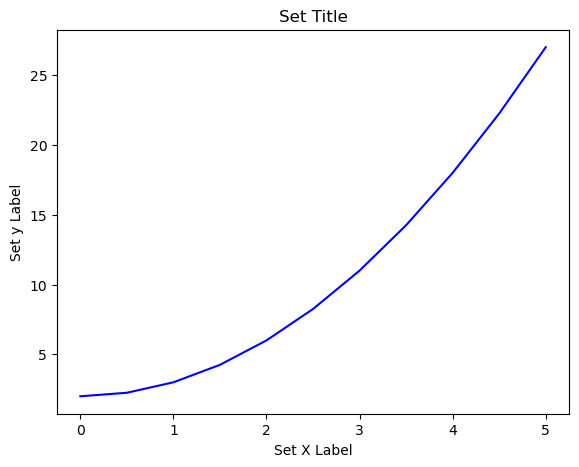
```
# Creates blank canvas
fig = plt.figure()

axes1 = fig.add_axes([0.1, 0.1, 0.8, 0.8]) # main axes l bottom w h
axes2 = fig.add_axes([0.5, 0.1, 0.4, 0.3]) # inset axes
```
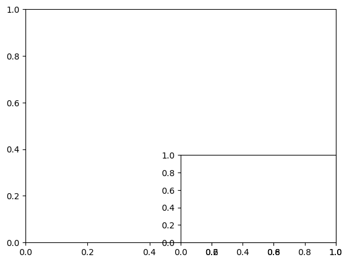
```
# Creates blank canvas
fig = plt.figure()

axes1 = fig.add_axes([0.1, 0.1, 0.8, 0.8]) # main axes l bottom w h
axes2 = fig.add_axes([0.2, 0.5, 0.4, 0.3]) # inset axes


# Larger Figure Axes 1
axes1.plot(x, y, 'b')
axes1.set_xlabel('X_label_axes1')
axes1.set_ylabel('Y_label_axes1')
axes1.set_title('Axes 1 Title')

# Insert Figure Axes 2
axes2.plot(y, x, 'r')
axes2.set_xlabel('X_label_axes2')
axes2.set_ylabel('Y_label_axes2')
axes2.set_title('Axes 2 Title')
```
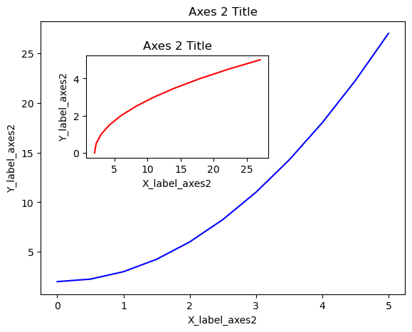
```
# Empty canvas of 1 by 2 subplots
fig, axes = plt.subplots(nrows=3, ncols=3)
plt.tight_layout()
```
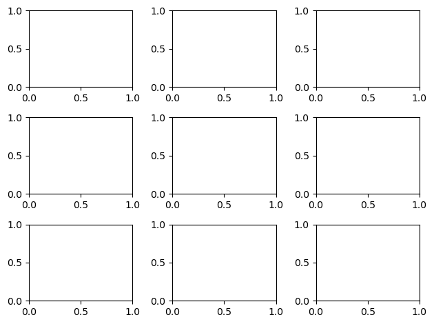
```

fig, axes = plt.subplots(nrows=1, ncols=2)

axes[0].plot(x,y)
axes[0].set_title('First Plot')
axes[1].plot(y,x)
axes[1].set_title('Second Plot')
plt.tight_layout()
```
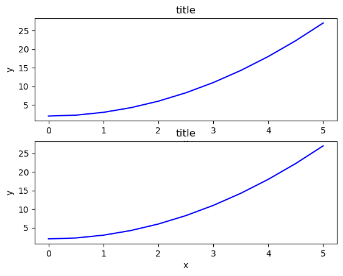
```
fig = plt.figure(figsize=(8,2))

ax = fig.add_axes([0,0,1,1])

ax.plot(x, x**2, label="x**2")
ax.plot(x, x**3, label="x**3")
ax.legend()
```
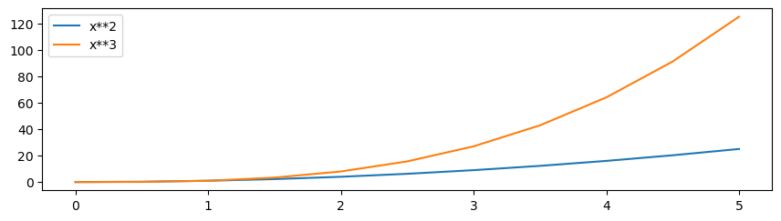
`# Most common to choose
ax.legend(loc=0) # let matplotlib decide the optimal location
fig`

`fig.savefig("filename.png")`
Points  also plotting
```python
fig = plt.figure()
ax = fig.add_axes([0,0,1,1])
ax.plot(x,y,color ='purple', lw=2,alpha = 0.5,ls='-',marker='o',markersize=10,markerfacecolor ='yellow',markeredgecolor='green') 
#Hex code is also supported
```
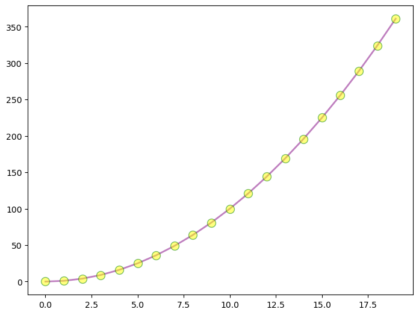
___
*Some glimpse of the phase-I*
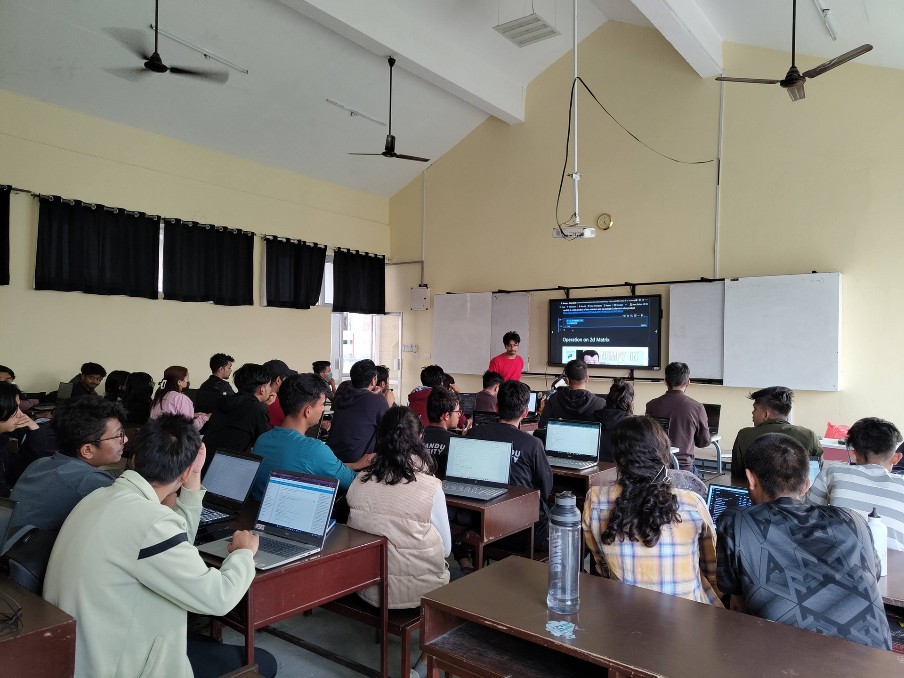